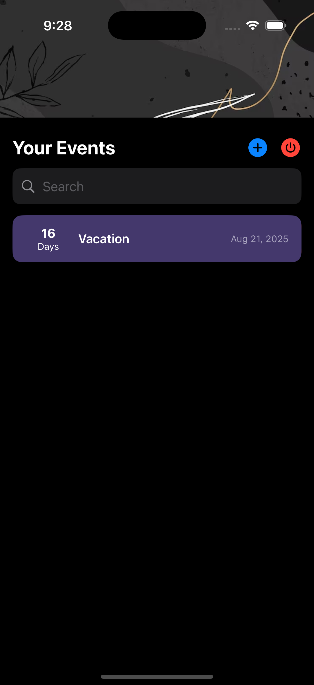

# 📱 TrackDown – Countdown App for Your Life's Events

TrackDown is a sleek and modern countdown app built for iOS that helps you keep track of upcoming events in style. Whether it's your friend's birthday, an exam, a trip, or any special occasion — TrackDown ensures you never miss a thing.

## 📸 Screenshots
### Light Mode
<p float="left">
  
  
  
</p>

---

## ✨ Features

- 🔢 **Create Custom Countdowns**: Add events with custom names, dates, and emojis.
- 📅 **Apple Calendar Integration**: Automatically sync your countdown events with your Apple Calendar.
- 🔔 **Smart Notifications**: Get timely notifications for upcoming events so you're always prepared.
- 🧘 **Minimalist UI**: Designed with simplicity and clarity to keep your focus on what matters.

---

## 🚀 How It Works

1. Open TrackDown and tap the "+" button to add a new event.
2. Set the name, date, emoji/icon, and any relevant details.
3. The app adds the event to your Apple Calendar.
4. You’ll receive a reminder as the event approaches.

---

## 📸 Screenshots

| Countdown View | Add Event View |
|----------------|----------------|
## Dark Mode
<p float="left">
  
  
</p>

---

## 📲 Installation

This app is currently available for iOS only.

> You can clone and run the project locally if you're a developer:

```bash
git clone https://github.com/Daipayan0p/trackdown-ios.git
cd trackdown-ios
open trackdown.xcodeproj
